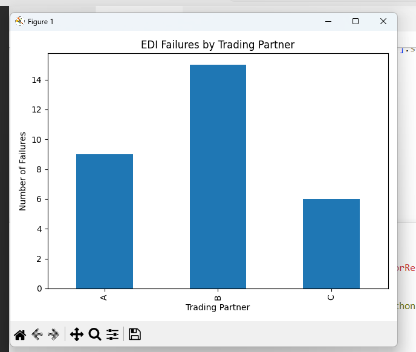

# EDI Failure Data Analysis

## 📊 Overview
This project analyzes EDI (Electronic Data Interchange) transaction failures to identify patterns, root causes, and opportunities to improve data processing performance.

## 📈 Key Insights
- Trading Partner B had the highest failure rate
- Failure patterns vary across document types (850, 810, 856)
- Monthly trends show increasing failures in March

## 🛠 Tools Used
- Python
- Pandas
- Matplotlib

## 📷 Sample Visualization

## 📌 What I Learned
- Data cleaning and grouping using pandas
- Identifying business patterns from raw data
- Creating visual insights for decision-making

## 🚀 Next Steps
- Add Power BI dashboard version
- Expand dataset for real-world simulation
- Add root cause classification model
